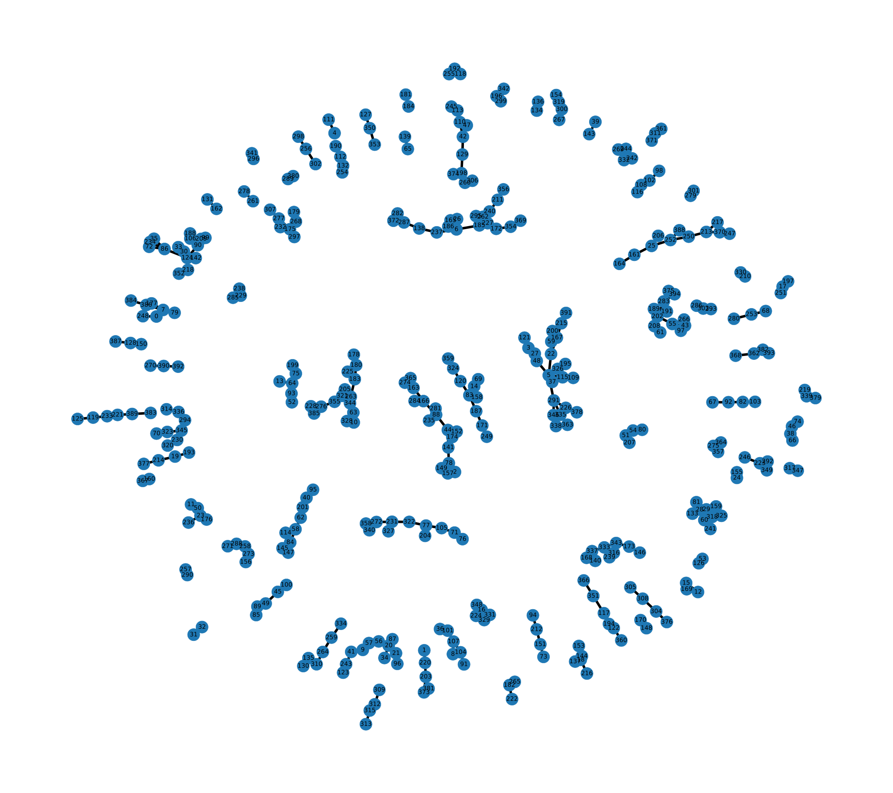

Chose a student dataset online. This dataset consisted about 395 rows and 33 columns with numeric and categorical data.
12 attributes were selected with mixed data types. Using the normalize function, returned a particular row with the categorical data being converted to numeric.
Using the distance function, Euclidean distance between 2 rows was used to compute the difference between them. Then computed a function to return a list of 2-pair tuples
signifying the 2nd index is closest to the first. Using this tuple list and networkx Library graph was visualized. In order to de-clutter it figure size was increased and
increased the node and font sizes. The layout is spread out wide so that each data point is visible. Spring layout of the networkx library was used .<?xml version="1.0" encoding="utf-8" standalone="no"?>

